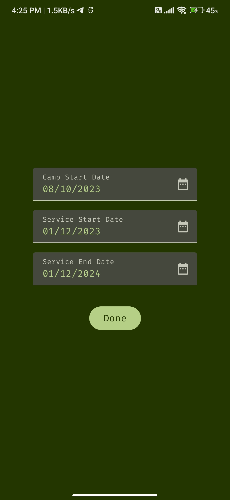
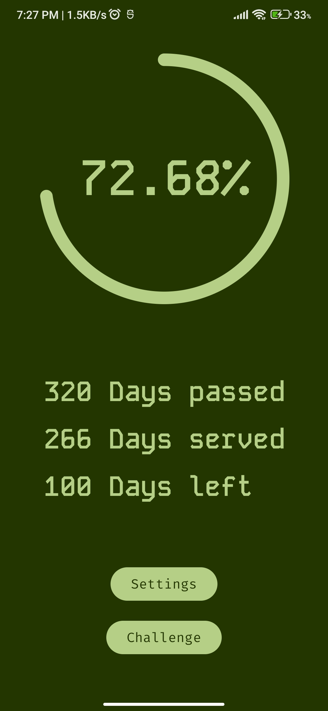
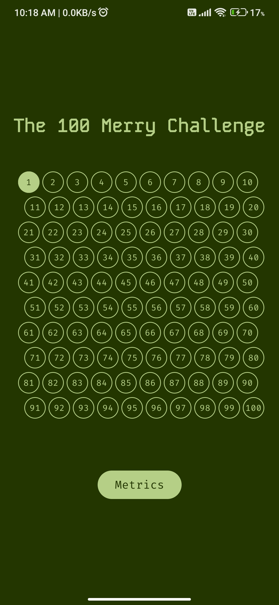
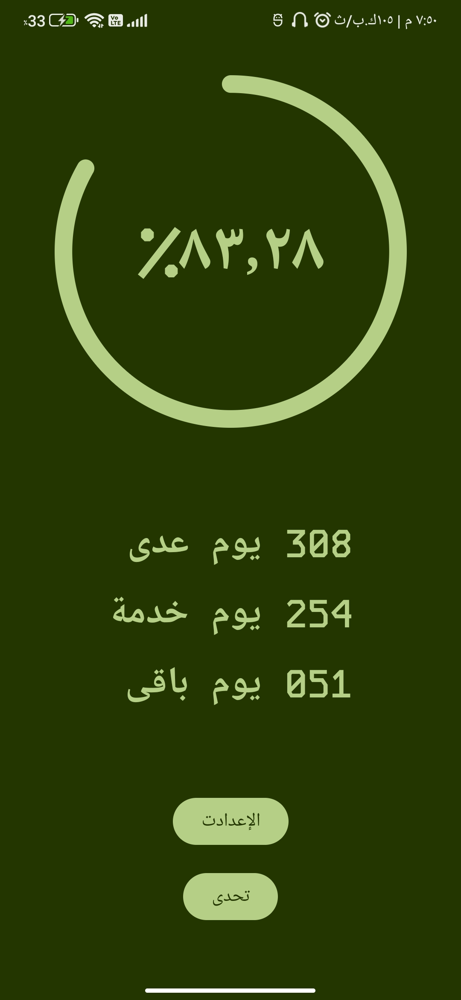

# Merry

This is app is playground for me getting to know compose, in the midst of the horrifying year.\
It operate upon three Dates:
- Start Date of Training Camp
- Start Date of Service
- End Date of Service

Then It Extracts Four Metrics:
- Passed Days form Training Camp
- Served Days
- Completion Percentage Of Service
- Left Days 

## Screenshots

### English
#### Normal

#### When There's less than or equal 100 Days

#### Completion

### Arabic
#### Normal

#### When There's less than or equal 100 Days

#### Completion

